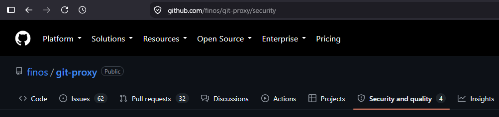
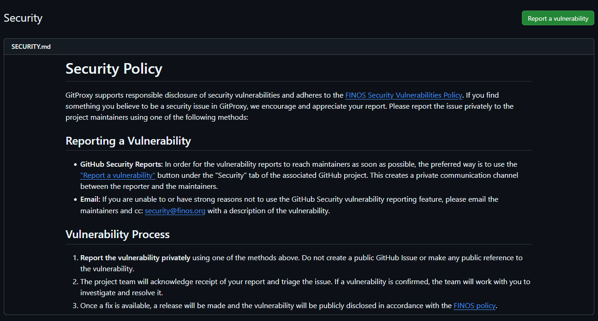
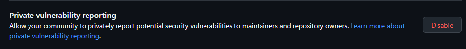

:::caution
Currently, FINOS does not operate a bug bounty program, and does not offer rewards or compensations of any kind in exchange for submitting potential bugs, issues or vulnerabilities.
:::

FINOS defines a **set of rules to manage the lifecycle of potential vulnerabilities and security incidents within FINOS projects**. Our goal is to guarantee:

1. Discretion for new and ongoing development activity around undisclosed security vulnerabilities
2. Transparency and guidance around security vulnerabilities that have been identified, patched and released as new versions

We have step-by-step guides on [how contributors can manage security vulnerabilities](#for-finos-open-source-contributors) and [how anyone can privately submit an undisclosed security vulnerability](#for-finos-open-source-consumers) to a FINOS project.

## What are Common Vulnerabilities and Exposures
The **Common Vulnerabilities and Exposures** (or [CVE](https://cve.mitre.org/cve/)) is a dictionary that provides definitions for publicly disclosed cybersecurity [vulnerabilities](https://cve.mitre.org/about/terminology.html#vulnerability) and [exposures](https://cve.mitre.org/about/terminology.html#exposure), although the term is normally used to identify CVE entries; each entry is comprised of an identification number, a description, and at least one public reference, you can check [an example on the cla-bot project](https://github.com/finos/cla-bot/issues/157). Please note that the term security vulnerability also comprises undisclosed ones, as opposed to CVEs, which only refer to publicly disclosed entries.

## For FINOS Open Source Consumers

**IMPORTANT!** No information should be made public about the vulnerability until it is formally announced at the end of this process. Do NOT create a GitHub Issue to track the vulnerability, since that will make the issue public. Commit messages should not make ANY reference to the security nature of the commit.

### Reporting a Vulnerability

In order to report a vulnerability in a FINOS project, follow these steps:

1. Visit the "Security and quality" tab of the project repository, available at `github.com/finos/<project-name>/security`:

    

2. Carefully read the project's `SECURITY.md` policy, in case any processes override what's described on this page:

    

3. Follow the submission steps in the project's security policy. Usually, this means clicking the "Report a vulnerability" button and filling in the [requested details](#details-to-include).
4. If the project doesn't have a SECURITY.md policy available, submit the vulnerability via email to a project Maintainer (ideally, the Lead Maintainer). You can find contact emails in the project's `MAINTAINERS.md` file. Also, CC the email to [security@finos.org](mailto:security@finos.org).
5. If the project doesn't provide a contact email for a maintainer, submit the report directly to [security@finos.org](mailto:security@finos.org).

**Important: Do NOT make a GitHub issue or discuss the vulnerability through public channels.**

### Details to include

When reporting a vulnerability, it's very helpful to provide as many details as possible, including:

- **Impact:** _What kind of vulnerability is it? Who is impacted?_
- **Patches:** _Has the problem been patched? What versions should users upgrade to?_
- **Workarounds:** _Is there a way for users to fix or remediate the vulnerability without upgrading?_
- **References:** _Are there any links users can visit to find out more?_
- **Screenshots (if applicable):** _Which user flows demonstrate the problem?_

### Vulnerability Remediation Process

1. The project's team members work privately with the reporter to resolve the vulnerability.
2. The affected FINOS project releases a new version including the fix.
3. The vulnerability is publicly announced.

For more details, see how maintainers [Manage new vulnerabilities](#managing-new-vulnerabilities) and how you can contribute to patching the issue.

### Browse security vulnerabilities for a project

Published security vulnerabilities are available in the "Security and quality" tab at the repository's main page, accessible via `github.com/finos/<project-name>/security`.

### Information Sharing

If you would like to share vulnerability information with domain experts (e.g. co-workers), you must first ask the project's Security Team (maintainers, etc.) for permission. It should be made clear that the information is not for public disclosure and that [security@finos.org](mailto:security@finos.org) or the Lead Maintainer must be kept in the loop on any communication regarding the vulnerability.

## For FINOS Open Source Contributors

**IMPORTANT!** No information should be made public about the vulnerability until it is formally announced at the end of this process. Do NOT create a GitHub Issue to track the vulnerability, since that will make the issue public. Commit messages should not make ANY reference to the security nature of the commit.

### Reporting a Vulnerability

Submitting a vulnerability report is identical to the process followed by project Consumers. See [the guide above](#for-finos-open-source-consumers) for reference.

### Setting up responsible disclosure

To start leveraging GitHub's native disclosure and remediation process, you must add a `SECURITY.md` file describing the disclosure process.

This is a sample `SECURITY.md` file that you may edit as appropriate and add to your project; just replace `PROJECT_NAME` and `PROJECT_URL` with the actual project name and GitHub URL:

```markdown
# Security Policy

{PROJECT_NAME} supports responsible disclosure of security vulnerabilities and adheres to the [FINOS Security Vulnerabilities Policy](https://community.finos.org/docs/governance/Software-Projects/cve-responsible-disclosure). If you find something you believe to be a security issue in {PROJECT_NAME}, we encourage and appreciate your report. Please report the issue privately to the [project maintainers]({PROEJCT_URL}/blob/main/MAINTAINERS.md) using one of the following methods:

## Reporting a Vulnerability

- **GitHub Security Reports:** In order for the vulnerability reports to reach maintainers as soon as possible, the preferred way is to use the ["Report a vulnerability"]({PROJECT_URL}/security) button under our "Security and quality" tab. This creates a private communication channel between you and the maintainers.
- **Email:** If you are unable to or have strong reasons not to use the GitHub Security vulnerability reporting feature, please email the maintainers directly and CC: [security@finos.org](mailto:security@finos.org) with a description of the vulnerability, along with relevant details (Impact, Patches, Workarounds, References and Screenshots).

## Vulnerability Process

1. **Report the vulnerability privately** using one of the methods above. Do not create a public GitHub Issue or make any public reference to the vulnerability.
2. The project team will acknowledge receipt of your report and triage the issue. If a vulnerability is confirmed, the team will work with you to investigate and resolve it.
3. Once a fix is available, a release will be made and the vulnerability will be publicly disclosed in accordance with the [FINOS policy](https://community.finos.org/docs/governance/Software-Projects/cve-responsible-disclosure).
```

Once a `SECURITY.md` file is added, you must enable private vulnerability reporting in your repository by going to **Settings** > **Advanced Security** > **Private Vunlerability Reporting** and clicking on "Enable":



If you don't have access to this menu, email [security@finos.org](mailto:security@finos.org) to request private vulnerability reporting to be activated.

### Collecting project CVE list

Since all CVE entries are labeled as security vulnerability, it is possible to use GitHub Issues UI to browse them. Alternatively, check the Advisories tab under the "Security and quality" tab of the project repository, also accessible at `github.com/finos/<project-name>/security/advisories`.

### Managing new vulnerabilities

A typical process for handling a new security vulnerability is as follows. Projects that wish to use other processes MAY do so, but **MUST** clearly and publicly document their process and have FINOS team review it ahead of time.

#### Accepting a new vulnerability

1. The person discovering the issue, the reporter, reports the vulnerability privately via GitHub's native disclosure process. This automatically notifies the maintainers and [security@finos.org](mailto:security@finos.org),
2. The project team sends an e-mail to the original reporter to acknowledge the report
3. The project team investigates the report and either rejects it or accepts it.
4. Optionally, the project team can edit the report if appropriate, and fill in or amend details including the affected/patched versions, severity and [CWE weaknesses](https://cwe.mitre.org/).

#### Working on a fix

The reporter and maintainer team collaborate on a fix via GitHub's native vulnerability management system. As part of the process, they must:

1. Create a temporary private fork by clicking on the "Create private fork" button in the draft advisory page
2. Clone the fork, make a branch and commit a fix to the vulnerability **without referencing the security nature of the commits**
3. Open a PR on the private fork, which will automatically show on the advisory page
4. Review, approve and merge the PR
5. Request a CVE from GitHub

Once all of these have been completed, GitHub will assign a CVE and it will be officially published, and merged to the `main` branch. If no automated release tooling is available, the team must manually make a new release, and backport the fixes to previous release lines if appropriate.

#### Apply fixes to all supported versions

As soon as the project team finds and implements a fix for the vulnerability, all supported versions (most likely GitHub branches) can be patched and released.

We highly recommend setting up release automation (Release Drafter, automatic version bumping) to simplify the process of backporting fixes to all active release branches. See [GitProxy's release-related workflows](https://github.com/finos/git-proxy/tree/main/.github/workflows) examples you can use in your own project.

Here's an [example of a detailed release policy](https://git-proxy.finos.org/docs/development/releases/) that enabled maintainers to speed up their release process and spread the load across the team.

#### Publishing

First, the team must release the patched version(s). Then, the following optional actions must be done **before** the vulnerability is published (via the GitHub Advisories UI):

1. Emailing [security@finos.org](mailto:security@finos.org) about the public disclosure
2. Notifying the original reporter about the disclosure
3. Relevant documentation must be updated (though it's highly recommended to do this *within* the private fork)

Note that FINOS and the original reporter are automatically notified by GitHub on any changes on the report status.

The following optional actions must be done **after** the vulnerability is published:

1. Creating follow-up issues to solve bugs that are out-of-scope for the original vulnerability
2. Creating any issue that referencing the vulnerability directly (via links, name, etc.) or indirectly

## Automating security vulnerabilities

FINOS provides multiple tools that adapt to languages and build platforms adopted by the project's codebase, please visit the [code validation page](https://community.finos.org/docs/development-infrastructure/code-validation/intro/). 

## Responsible Disclosure at Apache Software Foundation

We took great inspiration from the work that the Apache Software Foundation have done; we started from there, then adapted processes and contents around our requirements; below the links describing the ASF responsible disclosure.
- https://www.apache.org/security/
- https://www.apache.org/security/committers.html
