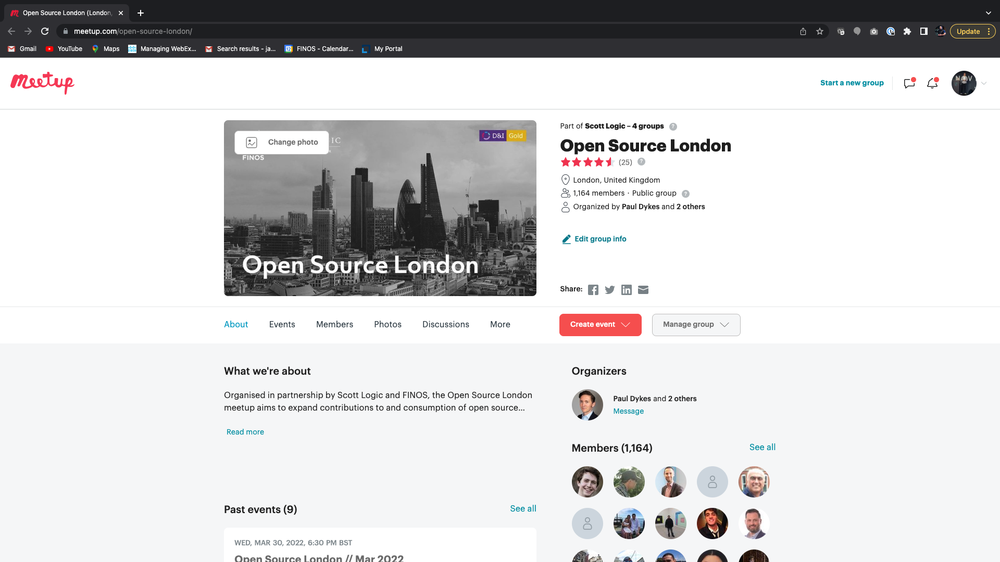

The following are details of all FINOS and FINOS Member / Partner meetups open to the FINOS and wider open source community to join. Please reach out to help@finos.org if you'd like to organize or present at a FINOS meetup.

## Presenting at a FINOS meetup

Organiser details are also provided for FINOS projects and special interest groups wanting to join, present or demo to any FINOS meetup community.

## FINOS Open Source UK Meetups

### Meetup Organisers

- Claire Cocks, Business Development Campaign Manager, Scott Logic - ccocks@scottlogic.com
- Paul Dykes, Content and Channel Manager, Scott Logic - PDykes@scottlogic.com

### UK Meetups

| Meetup Name           | Description                                                                                                                                                                                                                                                | Where to find us                              |
| :-------------------- | :--------------------------------------------------------------------------------------------------------------------------------------------------------------------------------------------------------------------------------------------------------- | :-------------------------------------------- |
| Open Source London    | Organised in partnership by FINOS and Scott Logic, the London Open Source Meetup aims to expand contributions to and consumption of open source technologies, while growing a healthy engineering community in the financial services industry.            | https://www.meetup.com/open-source-london/    |
| Open Source Edinburgh | Organised in partnership by FINOS and Scott Logic, the Edinburgh Open Source Fintech Meetup aims to expand contributions to and consumption of open source technologies, while growing a healthy engineering community in the financial services industry. | https://www.meetup.com/open-source-edinburgh/ |
| Open Source Bristol   | Organised in partnership by FINOS and Scott Logic, the Bristol Open Source Fintech Meetup aims to expand contributions to and consumption of open source technologies, while growing a healthy engineering community in the financial services industry.   | https://www.meetup.com/open-source-bristol/   |
| Open Source Leeds     | Organised in partnership by FINOS and Scott Logic, the Leeds Open Source Meetup aims to expand contributions to and consumption of open source technologies, while growing a healthy engineering community in the financial services industry.             | https://www.meetup.com/open-source-leeds/     |

## FDC3 Sweden Meetups

### Meetup Organisers

- Aleksandar Marinkovic - alex.marinkovic@linux.com

### Sweden Meetups

| Meetup Name | Description                                                                                                                                                                                                                                             | Where to find us                    |
| :---------- | :------------------------------------------------------------------------------------------------------------------------------------------------------------------------------------------------------------------------------------------------------ | :---------------------------------- |
| FDC3 Sweden | Organized in partnership with FINOS, the FDC3 Sweden Meetup aims to expand contributions to and consumption of FDC3 open standards for financial desktop technologies while growing a healthy engineering community in the financial services industry. | https://www.meetup.com/fdc3-sweden/ |
