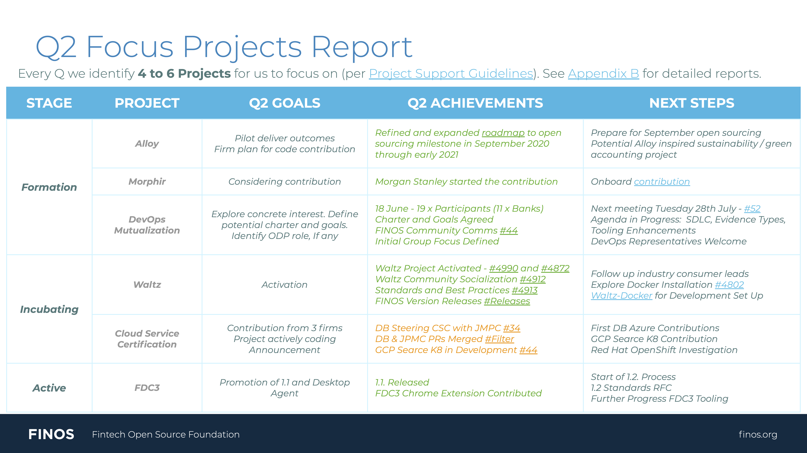

# What is a Quarterly Focus Project

Every quarter the Board evaluates and selects 5/6 focus projects that are in formation, incubation or active stage. Focus projects get special attention from the FINOS team, according to the [FINOS Project Support Guidelines](https://finosfoundation.atlassian.net/wiki/spaces/FINOS/pages/1511161857/Project+Support+Guidelines), during a 3 month period in order to achieve goals most often related to growing maturity, adoption and contribution, often resulting in the project evolving to the next stage in the [Project Lifecycle](../governance/Project-Lifecycle.md).

## Current focus projects

The focus projects for the current quarter (Q4 2020) are:

| Project                 | Lifecycle Stage | Q4 Target Goals                                                                                                  | FINOS Support POC | Progress (issues, a high level description, etc.)                                 |
|-------------------------|-----------------|-----------------------------------------------------------------------------------------------------------------------|-------------------|-----------------------------------------------------------------------------------|
| Git-proxy                   | Formation      | Grow Git Proxy community and complete code contribution into FINOS.                                 | @maoo      | [Contribution issue](https://github.com/finos/community/issues/65)                                       |
| Regulation Innovation SIG   | Approved       | SIG fully functional and structured. One project created.                                                                                      | @aitana16      | [SIG Onboarding](https://github.com/finos/community/issues/80). [Regulation Innovation SIG GitHub repo](https://github.com/finos/open-regtech-sig) |
| Cloud Service Certification | Incubating     | Public results for one end-to-end test. Forge pan-Industry partnership. | @mcleo-d          | [Repo](https://github.com/finos/cloud-service-certification)                                      |                                   |
| Symphony Java Toolkit    | Incubating      | Consolidate ecosystem  and expand contributors from other firms. | @mindthegab          |                 [Repo](https://github.com/finos/symphony-java-toolkit)                                                                  |

Reports on progress from the last quarter will be published below shortly after the quarterly Governing Board meeting. Join our [Community list](mailto:community+subscribe@finos.org) to stay up to date.

## Want to be a focus project?
If you are a FINOS project maintainer and you'd like the FINOS team to put forward your project as a candidate for quarterly focus project to the Board, [just raise an issue](https://github.com/finos/community/issues/new?title=Please%20consider%20%3Cproject%20name%3E%20as%20quarterly%20focus%20project%20for%20%3Cquarter%20year%3E&body=A%20brief%20description%20of%20your%20quarterly%20goals%20and%20how%20FINOS%20can%20help).

## Previous focus projects

### Q3 2020

### Q2 2020

### Q1 2020

