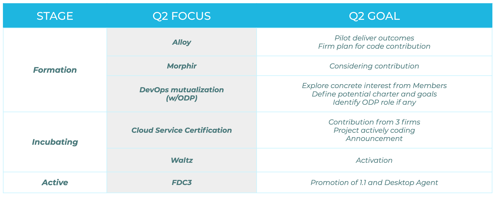
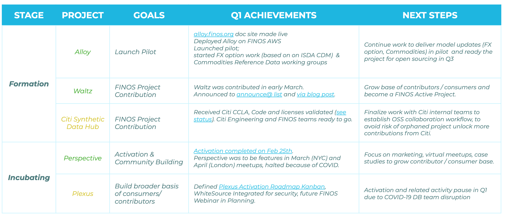

# What is a Quarterly Focus Project

Every quarter the Board evaluates and selects 5/6 focus projects that are in formation, incubation or active stage. Focus projects get special attention from the FINOS team, according to the [FINOS Project Support Guidelines](https://finosfoundation.atlassian.net/wiki/spaces/FINOS/pages/1511161857/Project+Support+Guidelines), during a 3 months period in order to achieve goals most often related to growing maturity, adoption and contribution, often resulting in the project evolve to the next stage in the [Project Lifecycle](../governance/Project-Lifecycle.md).

## Current focus projects

The focus projects for the current quarter (Q2 2020) are:

A report on progress will be published after its presented to the Governing Board in the upcoming meeting.

## Want to be a focus project?
If you are FINOS project maintainer and you'd like the FINOS team to put forward your project as a candidate for quarterly focus project to the Board, [just raise an issue](https://github.com/finos/community/issues/new?title=Please%20consider%20%3Cproject%20name%3E%20as%20quarterly%20focus%20project%20for%20%3Cquarter%20year%3E&body=A%20brief%20description%20of%20your%20quarterly%20goals%20and%20how%20FINOS%20can%20help).

## Previous focus projects 

### Q1 2020

